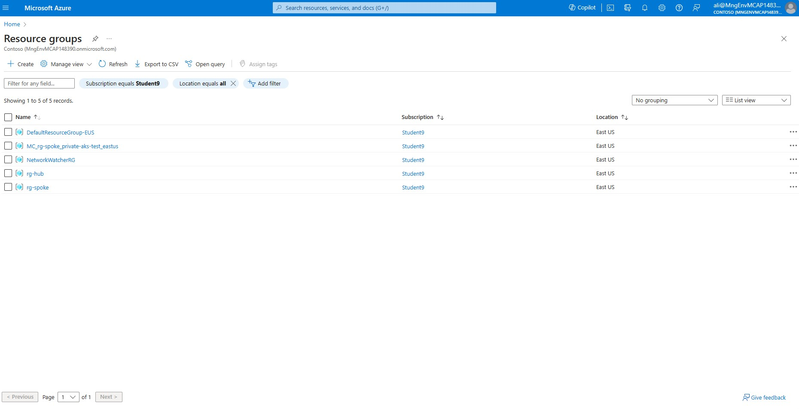
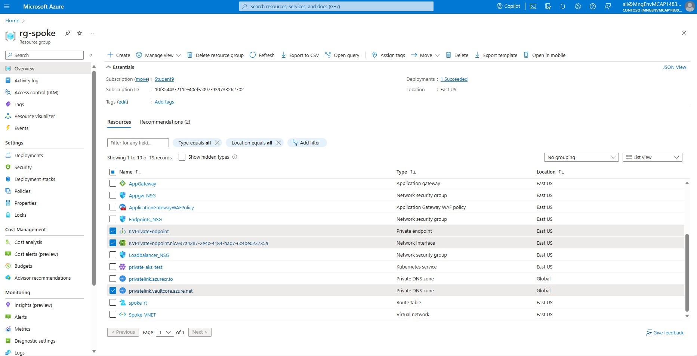
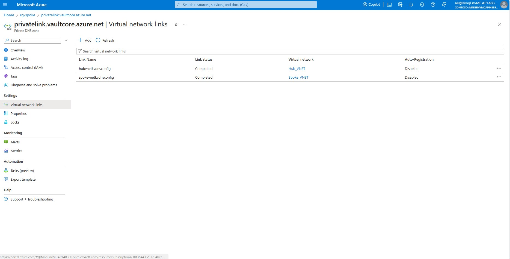
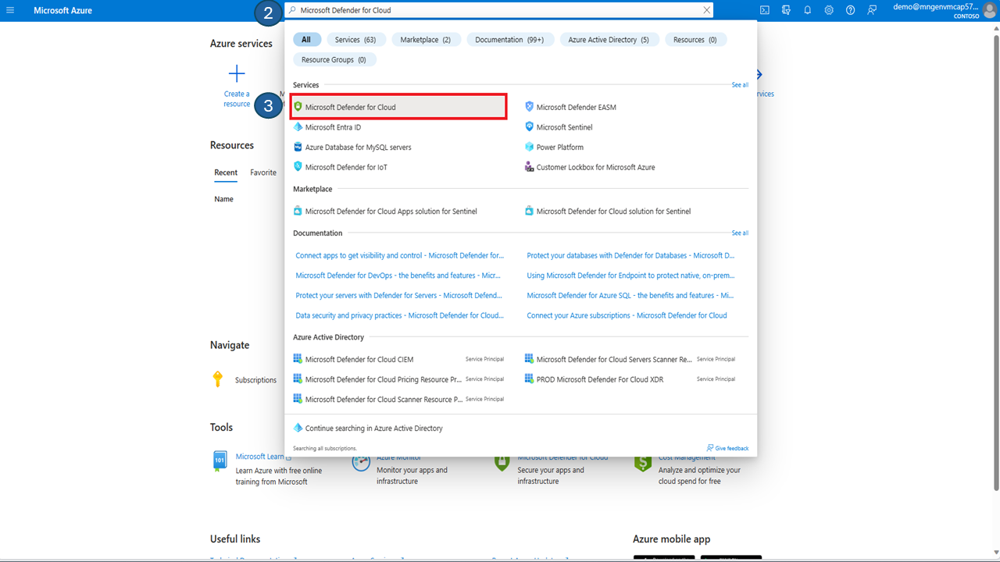
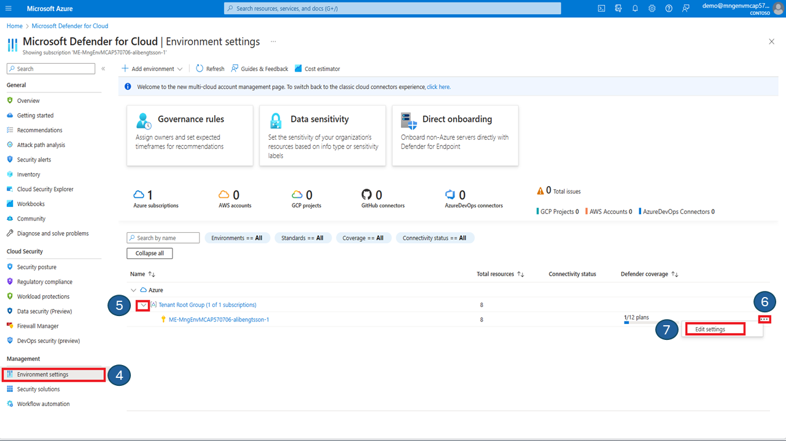

# Azure Kubernetes Service Workload Protection

The objective of this blog is to provide a concise guide on how to increase the security of your Kubernetes workloads by implementing "Workload Identity" and network policy in AKS. These features enable secure access to Azure KeyVault and control traffic flow between pods, providing an additional layer of security for your AKS cluster. Finally, as the icing on the cake, there are instructions on how to use Defender for Containers to detect vulnerabilities in container images.

By following the steps in this guide, you will learn how to configure workload identity, network policy in AKS and Azure KeyVault.

## Preconditions
This post build on a previous blog, https://techcommunity.microsoft.com/t5/apps-on-azure-blog/azure-kubernetes-service-baseline-the-hard-way/ba-p/4130496. The instructions there will equip you with a private AKS cluster and a lot of surrounding services, like Azure Container Reqistry, Application Gateway with WAF, etc. If you have completed the instructions there, you can simply continue with this guide. 

You could also create a more simple AKS cluster, using Microsoft quickstart guides here: https://learn.microsoft.com/en-us/azure/aks/tutorial-kubernetes-prepare-app?tabs=azure-cli. However, if you do you will have to take care to populate some environment varlibles to match the instructions below, like e.g. AKS_CLUSTER_NAME and STUDENT_NAME.


## 1.1 Deployment
First, create some environment variables, to make life easier.


### 1.1.1 Prepare Environment Variables for Infrastructure


> [!Note]
>The Azure KeyVault name is a global name that must be unique.

````
FRONTEND_NAMESPACE="frontend"
BACKEND_NAMESPACE="backend"
SERVICE_ACCOUNT_NAME="workload-identity-sa"
SUBSCRIPTION="$(az account show --query id --output tsv)"
USER_ASSIGNED_IDENTITY_NAME="keyvaultreader"
FEDERATED_IDENTITY_CREDENTIAL_NAME="keyvaultfederated"
KEYVAULT_NAME="<DEFINE A KEYVAULT NAME HERE>"
KEYVAULT_SECRET_NAME="redissecret"
````

### 1.1.2 Update AKS Cluster with OIDC Issuer

Enable the existing cluster to use OpenID connect (OIDC) as an authentication protocol for Kubernetes API server (unless already done). This allows the cluster to integrate with Microsoft Entra ID and other identity providers that support OIDC.

````bash
az aks update -g $SPOKE_RG -n $AKS_CLUSTER_NAME-${STUDENT_NAME}   --enable-oidc-issuer 
````

Get the OICD issuer URL. Query the AKS cluster for the OICD issuer URL with the following command, which stores the reult in an environment variable.

````bash
AKS_OIDC_ISSUER="$(az aks show -n $AKS_CLUSTER_NAME-${STUDENT_NAME} -g $SPOKE_RG  --query "oidcIssuerProfile.issuerUrl" -otsv)"
````

The variable should contain the Issuer URL similar to the following:
 ````https://eastus.oic.prod-aks.azure.com/9e08065f-6106-4526-9b01-d6c64753fe02/9a518161-4400-4e57-9913-d8d82344b504/````

### 1.1.3 Create Azure KeyVault

Create the Azure Keyvault instance. When creating the Keyvault, use "deny as a default" action for the network access policy, which means that only the specified IP addresses or virtual networks can access the key vault.

Your bastion host will be allowed, so use that one when you interact with Keyvault later.

````bash
az keyvault create -n $KEYVAULT_NAME -g $SPOKE_RG -l $LOCATION --default-action deny
````

Create a private DNS zone for the Azure Keyvault.

````bash
az network private-dns zone create --resource-group $SPOKE_RG --name privatelink.vaultcore.azure.net
````

Link the Private DNS Zone to the HUB and SPOKE Virtual Network

````bash
az network private-dns link vnet create --resource-group $SPOKE_RG --virtual-network $HUB_VNET_ID --zone-name privatelink.vaultcore.azure.net --name hubvnetkvdnsconfig --registration-enabled false

az network private-dns link vnet create --resource-group $SPOKE_RG --virtual-network $SPOKE_VNET_NAME --zone-name privatelink.vaultcore.azure.net --name spokevnetkvdnsconfig --registration-enabled false
````

Create a private endpoint for the Keyvault

First we need to obtain the KeyVault ID in order to deploy the private endpoint.

````bash
KEYVAULT_ID=$(az keyvault show --name $KEYVAULT_NAME \
  --query 'id' --output tsv)
````
Create the private endpoint in endpoint subnet.

````bash
az network private-endpoint create --resource-group $SPOKE_RG --vnet-name $SPOKE_VNET_NAME --subnet $ENDPOINTS_SUBNET_NAME --name KVPrivateEndpoint --private-connection-resource-id $KEYVAULT_ID --group-ids vault --connection-name PrivateKVConnection --location $LOCATION
````

Fetch IP of the private endpoint and create an *A record* in the private DNS zone.

Obtain the IP address of the private endpoint NIC card.
 ````bash
KV_PRIVATE_IP=$(az network private-endpoint show -g $SPOKE_RG -n KVPrivateEndpoint \
  --query 'customDnsConfigs[0].ipAddresses[0]' --output tsv)
 ````
Note the private IP address down.

  ````bash
echo $KV_PRIVATE_IP
 ````

Create the A record in DNS zone and point it to the private endpoint IP of the Keyvault.

````bash
  az network private-dns record-set a create \
  --name $KEYVAULT_NAME \
  --zone-name privatelink.vaultcore.azure.net \
  --resource-group $SPOKE_RG
````
Point the A record to the private endpoint IP of the Keyvault.
````bash
 az network private-dns record-set a add-record -g $SPOKE_RG -z "privatelink.vaultcore.azure.net" -n $KEYVAULT_NAME -a $KV_PRIVATE_IP
 ````


Validate your deployment in the Azure portal.


1) Navigate to the Azure portal at [https://portal.azure.com](https://portal.azure.com) and enter your login credentials.

2) Once logged in, click on **Resource groups** to view all of your resource groups in your subscription. You should see the 3 Resouce groups created during previous steps: **MC_rg-spoke_private-aks-xxxx_eastus**, **rg-hub** and **rg-spoke**.

Select **rg-spoke**



3)  Verify that the following resources exists: an **Azure KeyVault instance**, **KeyVault private endpoint**, **Private endpoint Network interface**, and a private DNS zone called **privatelink.vaultcore.azure.net**. 


4)  Select the **Private DNS zone**, called **privatelink.vaultcore.azure.net**.  
  
5)  On your left hand side menu, under **Settings** click on **Virtual network links**.

6)  Validate that there is a link name called **hubnetdnsconfig** and the link status is set to **Completed** and the virtual network is set to **Hub_VNET**, ensure you have a link to both the hub and also the spoke, the link status should be set to **completed**.



8) On the top menu, click on **Home**. Select **Resource Groups** then click on the resource group called **rg-hub**.

9)  Select Jumpbox VM called **Jumpbox-VM**.

10) In the left-hand side menu, under the **Connect** section, select ‘Bastion’. Enter the **credentials** for the Jumpbox VM and verify that you can log in successfully.

In the Jumpbox VM command line type the following command and ensure it returns the **private ip address of the private endpoint**.

````bash
dig <KEYVAULT NAME>.vault.azure.net
````
Example output:
````bash
azureuser@Jumpbox-VM:~$ dig alibengtssonkeyvault.vault.azure.net

; <<>> DiG 9.18.12-0ubuntu0.22.04.3-Ubuntu <<>> alibengtssonkeyvault.vault.azure.net
;; global options: +cmd
;; Got answer:
;; ->>HEADER<<- opcode: QUERY, status: NOERROR, id: 22014
;; flags: qr rd ra; QUERY: 1, ANSWER: 2, AUTHORITY: 0, ADDITIONAL: 1

;; OPT PSEUDOSECTION:
; EDNS: version: 0, flags:; udp: 65494
;; QUESTION SECTION:
;alibengtssonkeyvault.vault.azure.net. IN A

;; ANSWER SECTION:
alibengtssonkeyvault.vault.azure.net. 60 IN CNAME alibengtssonkeyvault.privatelink.vaultcore.azure.net.
alibengtssonkeyvault.privatelink.vaultcore.azure.net. 1800 IN A10.1.2.6

;; Query time: 12 msec
;; SERVER: 127.0.0.53#53(127.0.0.53) (UDP)
;; WHEN: Sun Oct 08 16:41:05 UTC 2023
;; MSG SIZE  rcvd: 138

````


Now, you should have an infrastructure that looks like this:


 ### 1.1.4 Add a Secret to Azure KeyVault

We have successfully created an instance of Azure KeyVault with a private endpoint and set up a private DNS zone to resolve the Azure KeyVault instance from the hub and spoke using Virtual Network links. Additionally, we have updated our AKS cluster to support OIDC, enabling workload identity.

The next step is to add a secret to Azure KeyVault instance.

> [!IMPORTANT]
> Because the Azure KeyVault is isolated in a VNET, you need to access it from the Jumpbox VM. Please log in to the Jumpbox VM, and set a few environment variables (or load all environment variables you stored in a file):

 ````
SPOKE_RG=rg-spoke
LOCATION=eastus
FRONTEND_NAMESPACE="frontend"
BACKEND_NAMESPACE="backend"
SERVICE_ACCOUNT_NAME="workload-identity-sa"
SUBSCRIPTION="$(az account show --query id --output tsv)"
USER_ASSIGNED_IDENTITY_NAME="keyvaultreader"
FEDERATED_IDENTITY_CREDENTIAL_NAME="keyvaultfederated"
KEYVAULT_SECRET_NAME="redissecret"
AKS_CLUSTER_NAME=private-aks
KEYVAULT_NAME=<WRITE YOUR KEYVAULT NAME HERE>
STUDENT_NAME=<WRITE YOUR STUDENT NAME HERE>
ACR_NAME=<NAME OF THE AZURE CONTAINER REGISTRY>

 ````

From the **Jumpbox VM** create a secret in the Azure KeyVault. This is the secret that will be used by the frontend application to connect to the (redis) backend.

 ````bash
 az keyvault secret set --vault-name $KEYVAULT_NAME --name $KEYVAULT_SECRET_NAME --value 'redispassword'
 ````

### 1.1.5 Add the KeyVault URL to the Environment Variable *KEYVAULT_URL*

 ````bash
 export KEYVAULT_URL="$(az keyvault show -g $SPOKE_RG  -n $KEYVAULT_NAME --query properties.vaultUri -o tsv)"
 ````

 ### 1.1.6 Create a managed identity and grant permissions to access the secret

Create a User Managed Identity. We will give this identity *GET access* to the keyvault, and later associate it with a Kubernetes service account. 

 ````bash
 az account set --subscription $SUBSCRIPTION 
 az identity create --name $USER_ASSIGNED_IDENTITY_NAME  --resource-group $SPOKE_RG  --location $LOCATION  --subscription $SUBSCRIPTION 

 ````

 Set an access policy for the managed identity to access the Key Vault.

 ````bash
 export USER_ASSIGNED_CLIENT_ID="$(az identity show --resource-group $SPOKE_RG  --name $USER_ASSIGNED_IDENTITY_NAME  --query 'clientId' -otsv)"

 az keyvault set-policy --name $KEYVAULT_NAME  --secret-permissions get --spn $USER_ASSIGNED_CLIENT_ID 
 ````


 ### 1.1.7 Connect to the Cluster

First, connect to the cluster if not already connected
 
 ````bash
 az aks get-credentials -n $AKS_CLUSTER_NAME-${STUDENT_NAME}  -g $SPOKE_RG
 ````

### 1.1.8 Create Service Account

The service account should exist in the frontend namespace, because it's the frontend service that will use that service account to get the credentials to connect to the (redis) backend service.

> [!Note]
> Instead of creating kubenetes manifest files, we will create them on the command line like below. In a real life case, you would create manifest files and store them in a version control system, like git.


First create the frontend namespace

````yaml
cat <<EOF | kubectl apply -f -
apiVersion: v1
kind: Namespace
metadata:
  name: $FRONTEND_NAMESPACE
  labels:
    name: $FRONTEND_NAMESPACE
EOF
````
Verify that the namespace called **frontend** has been created.
````bash
kubectl get ns
````

Then create a service account in that namespace. Notice the annotation for **workload identity**
````
cat <<EOF | kubectl apply -f -
apiVersion: v1
kind: ServiceAccount
metadata:
  namespace: $FRONTEND_NAMESPACE
  annotations:
    azure.workload.identity/client-id: $USER_ASSIGNED_CLIENT_ID
  name: $SERVICE_ACCOUNT_NAME
EOF
````


### 1.1.9 Establish Federated Identity Credential

In this step we connect the Kubernetes service account with the user defined managed identity in Azure, using a federated credential.

````bash
  az identity federated-credential create --name $FEDERATED_IDENTITY_CREDENTIAL_NAME --identity-name $USER_ASSIGNED_IDENTITY_NAME --resource-group $SPOKE_RG --issuer $AKS_OIDC_ISSUER --subject system:serviceaccount:$FRONTEND_NAMESPACE:$SERVICE_ACCOUNT_NAME
````

### 1.1.10 Build the Application

Now its time to build the application. In order to do so, first clone the applications repository:

````bash
git clone https://github.com/pelithne/az-vote-with-workload-identity.git
````

In order to push images, you may have to login to the registry first using your Azure AD identity: 

````bash
az acr login --name $ACR_NAME
````


Then run the following commands to build, tag and push your container image to the Azure Container Registry

````bash
cd az-vote-with-workload-identity
cd azure-vote 
docker build -t azure-vote-front:v1 .
docker tag azure-vote-front:v1 $ACR_NAME.azurecr.io/azure-vote-front:v1
docker push $ACR_NAME.azurecr.io/azure-vote-front:v1

````
The string after ````:```` is the image tag. This can be used to manage versions of your app, but in this case we will only have one version. 


### 1.1.11 Deploy the Application

We want to create some separation between the frontend and backend, by deploying them into different namespaces. Later we will add more separation by introducing network policies in the cluster to allow/disallow traffic between specific namespaces.


First, create the backend namespace

> [!Note]
> Instead of creating kubernetes manifest, we put them inline for convenience. Feel free to create yaml-manifests instead if you like.

````bash
cat <<EOF | kubectl apply -f -
apiVersion: v1
kind: Namespace
metadata:
  name: backend
  labels:
    name: backend
EOF
````
Verify that the namespace called **backend** has been created.

````bash
kubectl get ns
````

Then create the Backend application, which is a Redis store which we will use as a "database". Notice how we inject a password to Redis using an environment variable (not best practice obviously, but for simplicity).

````bash
cat <<EOF | kubectl apply -f -
apiVersion: apps/v1
kind: Deployment
metadata:
  name: azure-vote-back
  namespace: $BACKEND_NAMESPACE
spec:
  replicas: 1
  selector:
    matchLabels:
      app: azure-vote-back
  template:
    metadata:
      labels:
        app: azure-vote-back
    spec:
      nodeSelector:
        "kubernetes.io/os": linux
      containers:
      - name: azure-vote-back
        image: mcr.microsoft.com/oss/bitnami/redis:6.0.8
        ports:
        - containerPort: 6379
          name: redis
        env:
        - name: REDIS_PASSWORD
          value: "redispassword"
---
apiVersion: v1
kind: Service
metadata:
  name: azure-vote-back
  namespace: $BACKEND_NAMESPACE
spec:
  ports:
  - port: 6379
  selector:
    app: azure-vote-back
EOF
````

Then create the frontend. We already created the frontend namespace in an earlier step, so ju go ahead and create the frontend app in the frontend namespace.
> [!Note]
> A few things worh noting:
````azure.workload.identity/use: "true"```` - This is a label that tells AKS that workload identity should be used
````serviceAccountName: $SERVICE_ACCOUNT_NAME```` - Specifies that this resource is connected to the service account created earlier
````image: $ACR_NAME.azurecr.io/azure-vote:v1```` - The image with the application built in a previous step.
````service.beta.kubernetes.io/azure-load-balancer-ipv4: $ILB_EXT_IP```` - This "hard codes" the IP address of the internal LB to match what was previously configured in App GW as backend.


````bash
cat <<EOF | kubectl apply -f -
apiVersion: apps/v1
kind: Deployment
metadata:
  name: azure-vote-front
  namespace: $FRONTEND_NAMESPACE
  labels:
    azure.workload.identity/use: "true"
spec:
  replicas: 1
  selector:
    matchLabels:
      app: azure-vote-front
  strategy:
    rollingUpdate:
      maxSurge: 1
      maxUnavailable: 1
  minReadySeconds: 5 
  template:
    metadata:
      labels:
        app: azure-vote-front
        azure.workload.identity/use: "true"
    spec:
      serviceAccountName: $SERVICE_ACCOUNT_NAME
      nodeSelector:
        "kubernetes.io/os": linux
      containers:
      - name: azure-vote-front
        image: $ACR_NAME.azurecr.io/azure-vote-front:v1
        ports:
        - containerPort: 80
        resources:
          requests:
            cpu: 250m
          limits:
            cpu: 500m
        env:
        - name: REDIS
          value: "azure-vote-back.backend"
        - name: KEYVAULT_URL
          value: $KEYVAULT_URL
        - name: SECRET_NAME
          value: $KEYVAULT_SECRET_NAME
---
apiVersion: v1
kind: Service
metadata:
  name: azure-vote-front
  namespace: $FRONTEND_NAMESPACE
  annotations:
    service.beta.kubernetes.io/azure-load-balancer-internal: "true"
    service.beta.kubernetes.io/azure-load-balancer-internal-subnet: "loadbalancer-subnet"
spec:
  type: LoadBalancer
  ports:
  - port: 80
  selector:
    app: azure-vote-front
EOF
````

### 1.1.12 Validate the Application

To test if the application is working, you can navigate to the URL used before to reach the nginx test application. This time the request will be redirected to the Azure Vote frontend instead. If that works, it means that the Azure Vote frontend pod was able to fetch the secret from Azure KeyVault, and use it when connecting to the backend (Redis) service/pod.

You can also verify in the application logs that the frontend was able to connect to the backend.

To do that, you need to find the name of the pod:
````bash
kubectl get pods --namespace frontend
````
This should give a result timilar to this
````bash
NAME                                READY   STATUS    RESTARTS        AGE
azure-vote-front-85d6c66c4d-pgtw9   1/1     Running   29 (7m3s ago)   3h13m
````

Now you can read the logs of the application by running this command (but with YOUR pod name)
````bash
kubectl logs azure-vote-front-85d6c66c4d-pgtw9 --namespace frontend
````

You should be able to find a line like this:
````bash
Connecting to Redis... azure-vote-back.backend
````
And then a little later:
````bash
Connected to Redis!
````


### 1.1.13 Workload Network Policy

The cluster is deployed with Azure network policies. The Network policies can be used to control traffic between resources in Kubernetes.

This first policy will prevent all traffic to the backend namespace. 

````bash
cat <<EOF | kubectl apply -f -
apiVersion: networking.k8s.io/v1
kind: NetworkPolicy
metadata:
  name: deny-ingress-to-backend
  namespace: backend
spec:
  podSelector: {}
  ingress:
  - from:
    - podSelector:
        matchLabels: {}
EOF
````


Network policies are applied on new TCP connections, and because the frontend application has already created a persistent TCP connection with the backend it might have to be redeployed for the policy to hit. One way to do that is to simply delete the pod and let it recreate itself:

First find the pod name
````bash
kubectl get pods --namespace frontend
````
This should give a result timilar to this
````bash
NAME                                READY   STATUS    RESTARTS        AGE
azure-vote-front-85d6c66c4d-pgtw9   1/1     Running   29 (7m3s ago)   3h13m
````

Now delete the pod with the following command (but with YOUR pod name)

````bash
kubectl delete pod --namespace frontend azure-vote-front-85d6c66c4d-pgtw9
````

After the deletion has finished you should be able to se that the "AGE" of the pod has been reset.
````bash
kubectl get pods --namespace frontend

NAME                                READY   STATUS    RESTARTS        AGE
azure-vote-front-85d6c66c4d-9wtgd   1/1     Running   0               25s
````

You should also find that the frontend can no longer communicate with the backend and that when accessing the URL of the app, it will time out.


Now apply a new policy that allows traffic into the backend namespace from pods that have the label ````app: azure-vote-front````

````bash
cat <<EOF | kubectl apply -f -
apiVersion: networking.k8s.io/v1
kind: NetworkPolicy
metadata:
  name: allow-from-frontend
  namespace: backend # apply the policy in the backend namespace
spec:
  podSelector:
    matchLabels:
      app: azure-vote-back # select the redis pod
  ingress:
  - from:
    - namespaceSelector:
        matchLabels:
          name: frontend # allow traffic from the frontend namespace
      podSelector:
        matchLabels:
          app: azure-vote-front # allow traffic from the azure-vote-front pod
EOF
````

Once again you have to recreate the pod, so that it can establish a connection to the backend service. Or you can simply wait for Kubernetes to attemt to recreate the frontend pod. 


First find the pod name
````bash
kubectl get pods --namespace frontend
````

Then delete the pod (using the name of your pod)

````bash
kubectl delete pod --namespace frontend azure-vote-front-85d6c66c4d-pgtw9
````


This time, communication from azure-vote-front to azure-vote-back is allowed.


# Defender for Containers

**In This Article:**

- [Defender for Containers](#defender-for-containers)
  - [1.1 Introduction](#11-introduction)
  - [1.2 Prerequisites](#12-prerequisites)
  - [1.3 Generate a Security Alert for Kubernetes Workload](#13-generate-a-security-alert-for-kubernetes-workload)
  - [1.4 Import Vulnerable image to Container Registry](#14-import-vulnerable-image-to-container-registry)
  - [1.5 Review Microsoft Defender for Containers Recommendations](#15-review-microsoft-defender-for-containers-recommendations)


## 1.1 Introduction

Microsoft Defender for Containers is a cloud-native solution that helps you secure your containers and their applications. It protects your Kubernetes clusters from misconfigurations, vulnerabilities, and threats, whether they are running on Azure, AWS, GCP, or on-premises. With Microsoft Defender for Containers, you can:

- Harden your environment by continuously monitoring your cluster configurations and applying best practices.
- Assess your container images for known vulnerabilities and get recommendations to fix them.
- Protect your nodes and clusters from run-time attacks and get alerts for suspicious activities.
- Discover your data plane components and get insights into your Kubernetes and environment configuration.

Microsoft Defender for Containers is part of Microsoft Defender for Cloud, a comprehensive security solution that covers your cloud workloads and hybrid environments. You can enable it easily from the Azure portal and start improving your container security today. Learn more about Microsoft Defender for Containers from [this article](https://learn.microsoft.com/en-us/azure/defender-for-cloud/defender-for-containers-introduction).


During this activity you will:

* Scan container image for vulnerabilities.
* Simulate a security alert for Kubernetes workload.
* Investigate and review vulnerabilities.

Import the metasploit vulnerability emulator docker image from Docker Hub to your Azure container registry.

## 1.2 Prerequisites

Update the firewall to allow AKS to pull images from docker hub.

````bash
az network firewall application-rule create --collection-name 'aksdockerhub' --firewall-name $FW_NAME -n 'Allow_Azmon' --source-addresses '*' --protocols 'http=80' 'https=443' --target-fqdns "*.docker.io" "auth.docker.io" "registry-1.docker.io" "*.monitor.azure.com" "production.cloudflare.docker.com" --action Allow --priority 103 --resource-group $HUB_RG
````

Please make sure that Microsoft Defender for Containers is activated on your subscription. Here are the steps you can follow to enable it.

> [!IMPORTANT]
> Before proceeding with this lab exercise, it is necessary to enable Microsoft Defender for Cloud.


Validate Microsoft Defender for Cloud in the Azure portal.

1) Navigate to the Azure portal at [https://portal.azure.com](https://portal.azure.com) and enter your login credentials.

2) Type in **Microsoft Defender for Cloud** in the search field.
   
3) From the drop down menu click on **Microsoft Defender for Cloud**.


4) Click on **Environment settings** in the left hand side menu under the **Management** section.
   
5) Expand the **Tenant Root Group**
   
6) On the far right hand side of the subscription click on the **three dots** to open the context menu.
   
7) From the context menu click on **Edit settings**.


8) Valiate that **Defender CSPM** is enabled (toggle button set to On) and that monitoring coverage is set to **Full**.
9) Validate that the container plans is enabled (toggle button set to On) and that monitoring coverage is set to **Full**.
10) Login to your jumpbox, lets ensure that the Defender security profile is deployed onto your AKS cluster. run the following command:

````bash
kubectl get po -n kube-system | grep -i microsoft*
````

Example output:
````bash
azureuser@Jumpbox-VM:~$ kubectl get po -n kube-system | grep -i microsoft*
microsoft-defender-collector-ds-5spnc                  2/2     Running   0          79m
microsoft-defender-collector-ds-bqs96                  2/2     Running   0          79m
microsoft-defender-collector-ds-fxh7r                  2/2     Running   0          79m
microsoft-defender-collector-misc-65b968c857-nvnpk     1/1     Running   0          79m
microsoft-defender-publisher-ds-qzzl8                  1/1     Running   0          79m
microsoft-defender-publisher-ds-vk8xl                  1/1     Running   0          79m
microsoft-defender-publisher-ds-x6dxw                  1/1     Running   0          79m
azureuser@Jumpbox-VM:~$ 
````


## 1.3 Generate a Security Alert for Kubernetes Workload


Login to the jumpbox and launch a pod that executes a test command, to simulate a security alert in Microsoft Defender for cloud.

Create a blank file with the following command.

````bash
vim mdctest.yaml
````

In the editor that appears, paste this YAML manifest, which will launch a pod named mdc-test with ubuntu version 18.04 as container image.

````bash
apiVersion: v1
kind: Pod
metadata:
    name: mdc-test
spec:
    containers:
        - name: mdc-test
          image: ubuntu:18.04
          command: ["/bin/sh"]
          args: ["-c", "while true; do echo sleeping; sleep 9600;done"]

````
 *Save and quit*.

Apply the configuration in the file mdctest.yaml. this will create a Pod in the namespace default.

````bash
kubectl apply -f mdctest.yaml
````

Verify that the Pod is in a running state:

````bash
kubectl get pods 
````

Example output:

````bash
NAME       READY   STATUS    RESTARTS   AGE
mdc-test   1/1     Running   0          8s
````
Lets run a bash shell inside the container named **mdc-test**. The bash shell is a common command-line interface that allows you to run various commands and scripts. To do this, we use the following command:

````bash
kubectl exec -it mdc-test -- bash
````
We now whant to copy and run the echo binary, which is a program which prints its arguments to the standard output. this is useful for testing the security alert system in Microsoft Defender for Cloud.

Copy the echo binary to a file named asc_alerttest_662jfi039n in the current working directory.

````bash
cp /bin/echo ./asc_alerttest_662jfi039n
````
Execute the echo binary and print "testing eicar pipe" to the standard out.

````bash
./asc_alerttest_662jfi039n testing eicar pipe
````
Example output:

````bash
mdc@mdc-test: ./asc_alerttest_662jfi039n testing eicar pipe
testing eicar pipe
````
Verify that Microsoft defender has triggered a security alert in Microsoft Defender for Cloud.

1) Go to https://portal.azure.com in your browser and log in if needed.

2) Once you have successfully logged in to Azure, Type in **Microsoft Defender for Cloud** in the search field. 
3) From the drop down menu click on  **Microsoft Defender for Cloud**.


4) On your left hand side menu, under **General** section click on **Security alerts**.

5) You should now see the Security alert, generated by Microsoft Cloud Defender. Click on the **Alert**. 


6) Review the security assessment by clicking on **View full details**.

7) Once you have reviewed the details of the simulated security alert. Put the status of the alert from **Active** to **Resolved**. The security alert will dissapear from the security alert list.


8) Delete the running pod from the AKS cluster

````bash
kubectl delete pods mdc-test
````

## 1.4 Import Vulnerable image to Container Registry

login to your container registry:

````bash
az acr login --name <ACR_NAME>
````

Download the docker image to your **jumpbox VM**:

````bash
docker pull docker.io/vulnerables/metasploit-vulnerability-emulator
````

Tag the docker image:

````bash
docker tag vulnerables/metasploit-vulnerability-emulator $ACR_NAME.azurecr.io/metasploit-vulnerability-emulator
````

Push the vulnerable docker image to azure container registry.

````bash
docker push $ACR_NAME.azurecr.io/metasploit-vulnerability-emulator
````

## 1.5 Review Microsoft Defender for Containers Recommendations

 In this section, you will learn how to review the security recommendations that Defender for Containers generates for your clusters and containers. These recommendations are based on the continuous assessment of your configurations and the comparison with the initiatives applied to your subscriptions. You will also learn how to investigate and remediate the issues that are identified by Defender for Containers.

1) In the Azure portal, Type in **Container registries** in the search field.

2) From the drop down menu click on  **Container Registries**.


3) Click on your **container registry** from the list.


4) On the menu to the left hand side click on **Microsoft Defender for Cloud** to view your **recommendations**.

5) Notice that we have a new recommendation called **Container registry image should have vulnerability findings resolved**


6) To learn how to fix the vulnerability, click on **view additonal recommendations in Defender for cloud**


7) To get more details and mitigation steps for a specific vulnerability, select it from the list. Microsoft Defender for cloud will guide you to harden your container image.


8) Select or search for a **CVE** under the vulnerabilities from the list.

9) **Review** the detailed recommendations from Microsoft Defender for Cloud.


